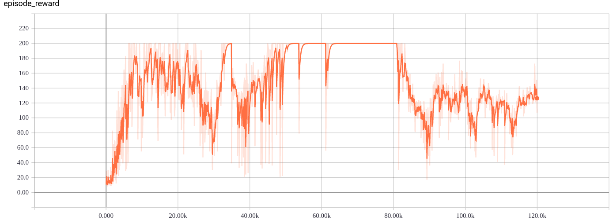

[Back to contents](../README.md#contents)

[CartPole](https://gym.openai.com/envs/CartPole-v0/) is an OpenAI Gym environment. A cart moves along a track. It is controlled by applying force forth and back. The aim is to prevent a pole attached to cart from falling over. A reward is +1 each step while the pole stays upright. The game ends if pole declines from vertical by more then 15 degrees, or if the cart moves more than 2.4 units away from starting position. The aim is to keep the pole upright for 200 steps. See the cart-pole problem described by A.G. Barto, R.S. Sutton, and C.W. Anderson in Neuronlike Adaptive Elements That Can Solve Difficult Learning Control Problems [Barto83].

The observation is a vector of four numbers (the cart position and speed and the pole angle and angular speed). The action is discrete from [0, 1] for force application direction.

## DA3C
To run it navigate to this directory and start `relaax run -c da3c.yaml`.  It takes several minutes to converge. Wait for 300 episodes.  Use `tensorboard --logdir logs/metrics` to follow progress. The episode reward will be 200 is most episodes.

## DQN
DQN runs in four favours. They are different in command lines only. Use `relaax run -c dqn.yaml` for plain DQN, `relaax run -c dqn.double.yaml` for double DQN, `relaax run -c dqn.dueling.yaml` for dueling DQN and `relaax run -c dqn.yaml` for double dueling DQN. It takes half of hour to converge. Use `tensorboard --logdir logs/metrics` to follow progress. The episode reward will be 200 is most episodes.

## Policy gradient
To run it navigate to this directory and start `relaax run -c policy-gradient.yaml`. It takes couple of minutes to converge. Use `tensorboard --logdir logs/metrics` to follow progress. The episode reward will be 200 is most episodes.

## TRPO
TRPO runs in three favours. They are different in command lines only. Use `relaax run -c trpo.ppo.yaml` for PPO, `relaax run -c trpo.trpo-d1.yaml` for TRPO-D1, `relaax run -c trpo.trpo-d2.yaml` for TRPO-D2. It takes five minutes to converge. Use `tensorboard --logdir logs/metrics` to follow progress. The episode reward will be 200 is most episodes.
