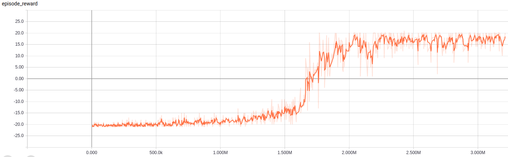

[Back to contents](../README.md#contents)

[Pong](https://gym.openai.com/envs/Pong-v0/) is an OpenAI Gym environment. This is classic Atari 2660 game.
The observation is RGB image of screen. The action is discrete from [0, 5] range.

## DA3C
We run DA3C with LSTM to resolve Pong. Navigate to this directory and start `relaax run -c da3c.yaml -n 4`.
It takes about a couple of hours to converge. Wait for 2.0M steps.
Use `tensorboard --logdir logs/metrics` to follow progress.
Episode reward will be about 20.

