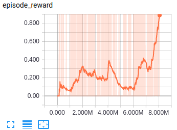
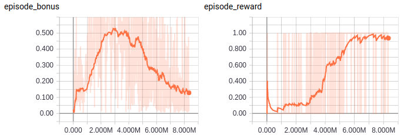

[Back to contents](../README.md#contents)

It is set to [ppaquette/gym-doom](https://github.com/ppaquette/gym-doom),
which is an extension to OpenAI Gym environment to work with `vizdoom`.
The observation is RGB image of screen. The action is discrete, and
the set of possible actions to each game type you can find there: `ppaquette_gym_doom/__init__.py`
The default level is 'ppaquette/DoomMyWayHome-v0' which has `4` possible actions.

We run DA3C with LSTM to resolve this environment.
To run it navigate to this directory and start `relaax run -c da3c.yaml -n 4`.
It takes several hours to converge. Wait for 8-10M steps.
Use `tensorboard --logdir logs/metrics` to follow progress.
Episode reward will be about 1 most of the time:

`DA3C-LSTM-4` on ppaquette Gym's Doom:

To get better result it allows to use `ICM` (Intrinsic Curiosity Module).  
It also takes several hours to converge. Wait for 5-7M steps.  
`DA3C-LSTM-ICM-4` on ppaquette Gym's Doom:

